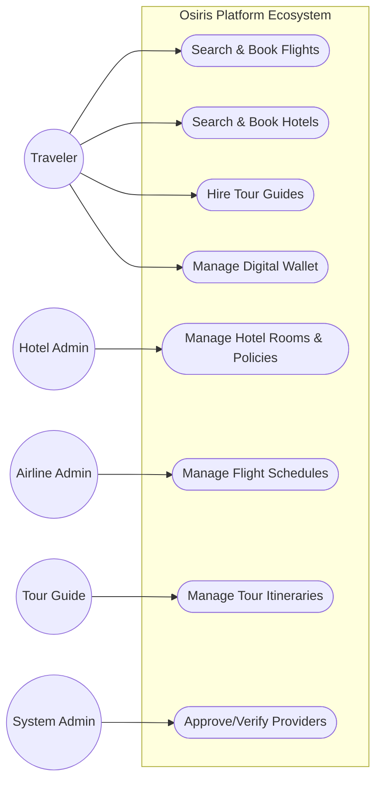
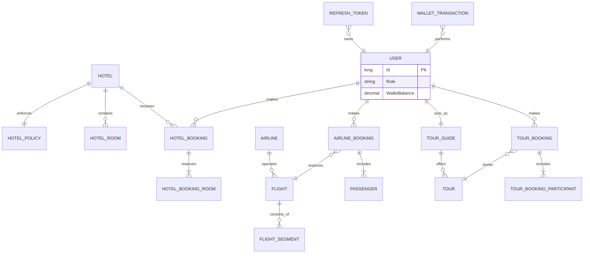
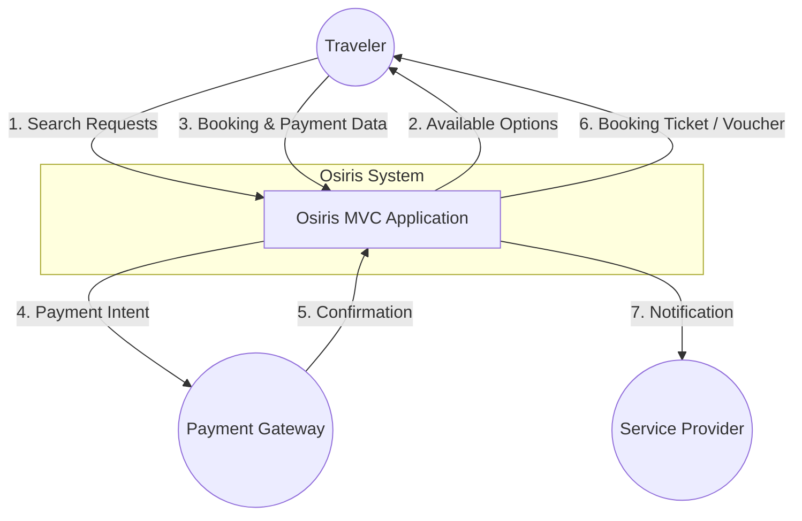
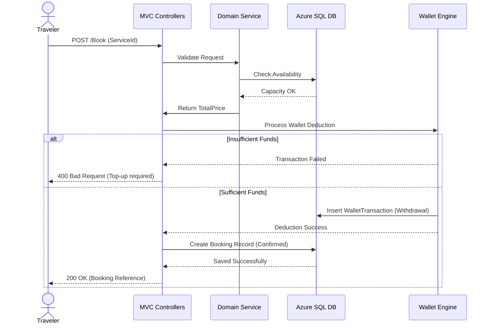
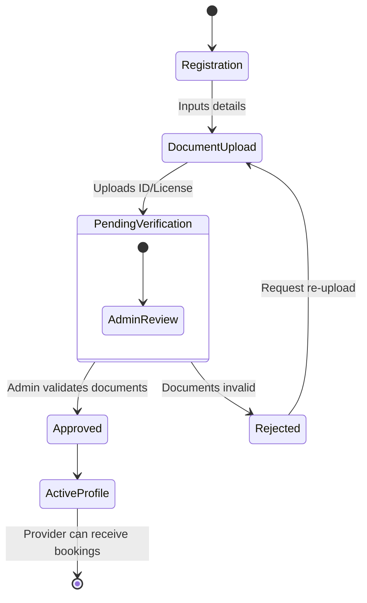
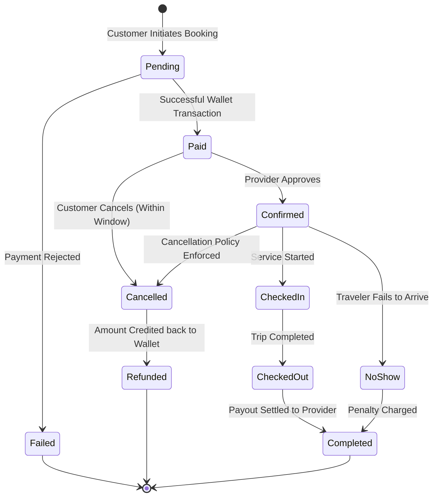
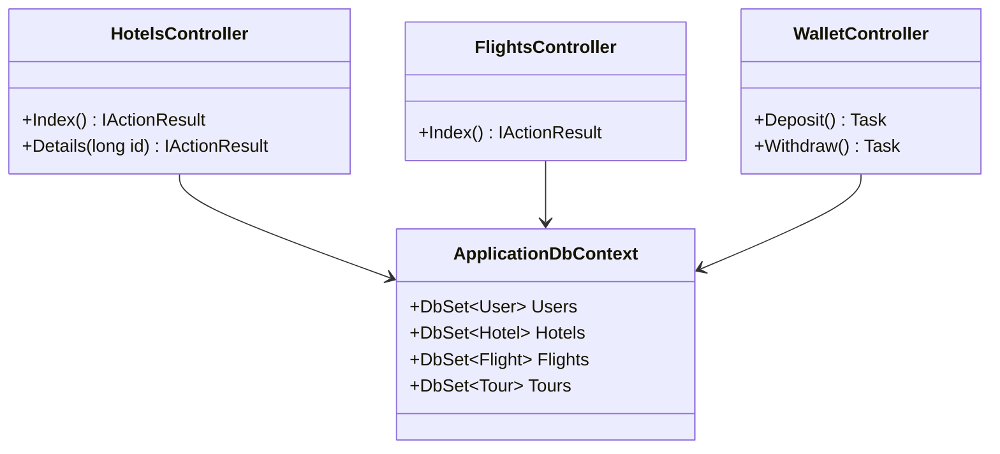
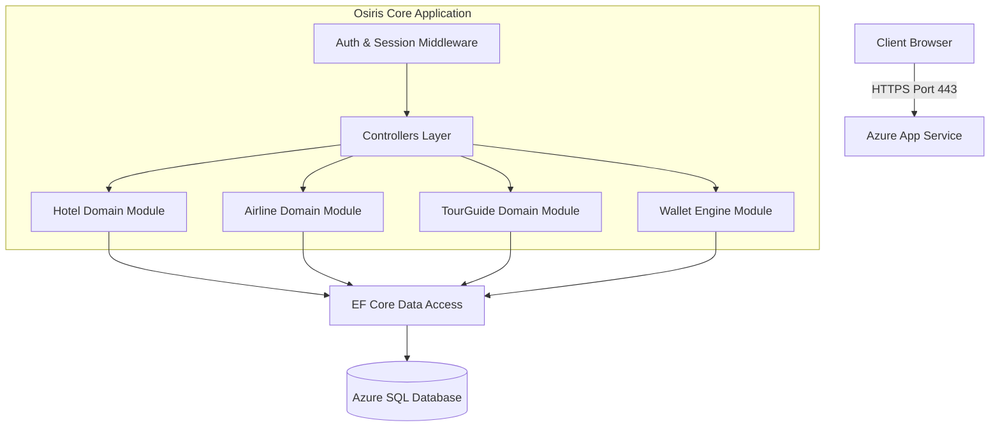
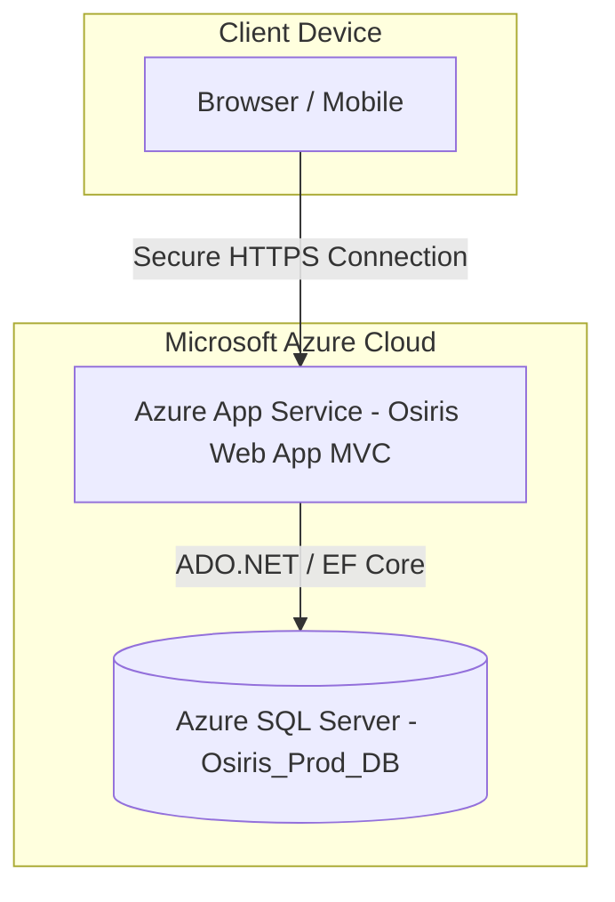

# 4. System Analysis & Design

## 4.1 Problem Statement & Objectives

### Problem Statement
The current travel and tourism industry suffers from fragmentation. Travelers must use multiple decentralized platforms to book flights, reserve hotel rooms, and hire local tour guides. This lack of integration leads to a poor user experience, complicated payment processes, and difficulty in managing comprehensive travel itineraries.

### Objectives
The objective is to design and develop **Osiris**, a centralized, multi-module unified travel platform. The system aims to integrate Airlines, Hotels, and Tour Guides into a single ecosystem, providing a seamless booking experience, centralized wallet management, and a unified authentication system for all stakeholders.

### 4.1.1 Use Case Diagram & Descriptions



**Use Case Descriptions:**

* **Traveler:** Can search for travel services, create bookings across all three modules (Airlines, Hotels, Tours), manage companions, and pay using the integrated digital wallet.
* **Hotel Admin:** Manages hotel profiles, room availability (`HotelRoom`), dynamic pricing, and cancellation policies (`HotelPolicy`).
* **Airline Admin:** Manages flight routes (`FlightSegment`, `FlightLayover`), airplane seating, and monitors airline bookings.
* **Tour Guide:** Creates tour itineraries (`Tour`), manages bookings, and handles withdrawal requests for their earnings.
* **System Admin:** Verifies documents for Hotels and Airlines, approves Tour Guide licenses, and manages platform commissions.

### 4.1.2 Functional & Non-Functional Requirements

**Functional Requirements:**

1. **Unified Authentication:** The system must support role-based access control (RBAC) handling `UserRole` (User, Admin, Tourguide, Hotel, Airline) with JWT/Cookie sessions.
2. **Wallet System:** Process deposits, withdrawals, and refunds (`WalletTransaction`) with strict precision.
3. **Modular Booking Engine:** Handle relational bookings separately for Hotels, Flights, and Tours.
4. **Review System:** Users must be able to leave ratings and comments across all entities.

**Non-Functional Requirements:**

1. **ACID Compliance:** All financial transactions must strictly adhere to ACID properties to prevent double-booking.
2. **Scalability:** The database architecture must isolate domains (using prefixes like `hotel_`, `airline_`, `tourguide_`).
3. **Security:** Passwords must be hashed (`PasswordHash`), and sensitive endpoints must be protected.

### 4.1.3 Software Architecture

The Osiris system is built utilizing a **Modular Monolithic N-Tier Architecture** on top of the `.NET 8` framework.

* **Presentation Layer:** ASP.NET Core MVC (Controllers & Razor Views).
* **Business Logic Layer:** Encapsulates domain rules for each module independently.
* **Data Access Layer (DAL):** Utilizes **Entity Framework Core** (Code-First) with `ApplicationDbContext`.

---

## 4.2 Database Design & Data Modeling

### 4.2.1 ER Diagram (Entity-Relationship Diagram)



### 4.2.2 Logical & Physical Schema

The relational database is highly normalized to the **3rd Normal Form (3NF)**.

* **Naming Conventions:** Tables are prefixed (`hotel_`, `airline_`, `tourguide_`) to logically group schema objects within the single `ApplicationDbContext`.
* **Keys & Relationships:** `BIGINT` is used for all Primary Keys. Strict Foreign Key constraints (`DeleteBehavior.Restrict` vs `Cascade`) are applied based on domain logic.
* **Data Types Optimization:** Financial amounts (`Price`, `WalletBalance`) use `decimal(18,2)` to prevent floating-point precision errors. Dates use `DateTime2`.

---

## 4.3 Data Flow & System Behavior

### 4.3.1 DFD (Data Flow Diagram) - Context Level



### 4.3.2 Sequence Diagram: Booking & Wallet Deduction Flow



### 4.3.3 Activity Diagram: Provider Verification Workflow



### 4.3.4 State Diagram: Booking Lifecycle



### 4.3.5 Class Diagram



---

## 4.4 UI/UX Design & Prototyping

### 4.4.1 Wireframes & Mockups

The interface layout follows a modular design implemented through ASP.NET Core Razor Views, optimized for both desktop and mobile viewports.

1. **Main Landing Page (`Home/Index.cshtml`):** Features a unified dynamic search engine bar allowing global queries across flights, accommodations, and guided tours.
2. **Listing Pages (`Hotels/Index`, `Flights/Index`):** Utilizes a split-screen approach on desktops—left side handles advanced filtering (price range, star rating, layovers), and the right side dynamically displays result cards.
3. **User Dashboard (`User/Dashboard.cshtml`):** A consolidated private portal containing sections for `MyHotelBookings`, `MyFlightBookings`, and Wallet Balance.

### 4.4.2 UI/UX Guidelines

* **Color Palette:** Standard corporate travel identity using deep blues (Trust/Reliability), vibrant teals (Call-to-Action buttons), and clean light-grays for backgrounds.
* **Typography:** Clean sans-serif typefaces (e.g., Segoe UI, Roboto) with hierarchical text layouts across all Razor partial views (`_Layout.cshtml`).
* **Accessibility:** Form fields contain semantic HTML tags, explicit labeling, and structural contrast ratios adhering to WCAG standards.

---

## 4.5 System Deployment & Integration

### 4.5.1 Technology Stack

* **Backend Framework:** ASP.NET Core MVC (.NET 8)
* **Frontend:** HTML5, CSS3 (Bootstrap/Tailwind), JavaScript, Razor Pages
* **Database:** Microsoft Azure SQL Database
* **ORM:** Entity Framework Core (EF Core)
* **Cloud Hosting:** Microsoft Azure App Service

### 4.5.2 Component Diagram



### 4.5.3 Deployment Diagram (Azure Infrastructure)



---

## 4.6 Additional Deliverables

### 4.6.1 API Documentation (Internal Endpoints)

Although primarily an MVC application, internal API endpoints are used for dynamic AJAX calls:

* `POST /api/wallet/deposit`: Adds funds to `WalletBalance`.
* `GET /api/publicrooms/available`: Fetches unbooked room instances based on `checkIn` and `checkOut`.
* `POST /api/tour/create`: Registered guides register new travel itineraries.

### 4.6.2 Testing & Validation Plan

1. **Unit Testing:** Using **xUnit** and **Moq** to test isolated business logic (e.g., verifying that a wallet deduction decreases the user's `WalletBalance` without floating-point errors).
2. **Integration Testing:** Validating EF Core `DeleteBehavior.Cascade` configurations to ensure deleting a hotel instance correctly cascades to erase all corresponding `HotelRooms` via an isolated SQL Test DB.
3. **User Acceptance Testing (UAT):** Simulating end-to-end user journeys (Search -> Book -> Wallet Deduction -> Confirmation) to guarantee operational readiness.

### 4.6.3 Deployment Strategy (Azure CI/CD)

The deployment process is highly automated to ensure zero-downtime rollouts:

1. **Version Control:** The codebase is hosted on GitHub using the GitFlow branching strategy (`main` for production, `dev` for staging).
2. **CI/CD Pipeline:** Configured using **GitHub Actions**. Upon merging a Pull Request into the `main` branch, the workflow automatically restores dependencies, builds the project, and executes unit tests.
3. **Azure App Service Deployment:** If tests pass, the compiled artifact is automatically pushed to the **Azure App Service** instance.
4. **Database Migrations:** Entity Framework Core migrations (`Update-Database`) are applied securely to the live **Azure SQL Database** during the deployment pipeline to keep the schema synchronized with the application models.

```
